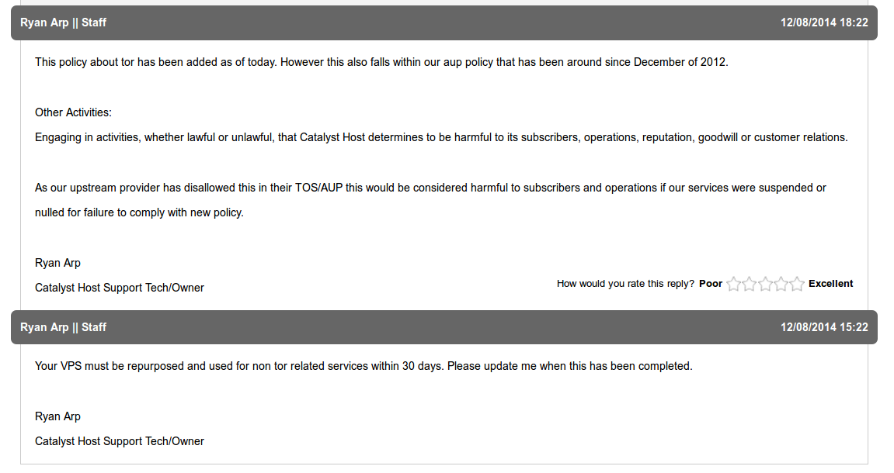
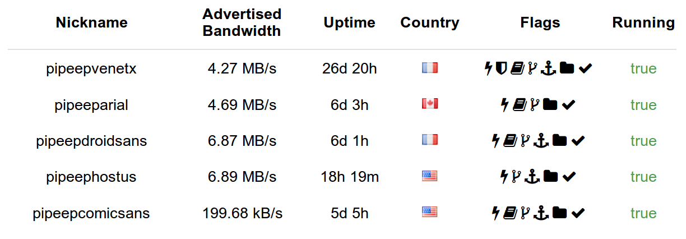
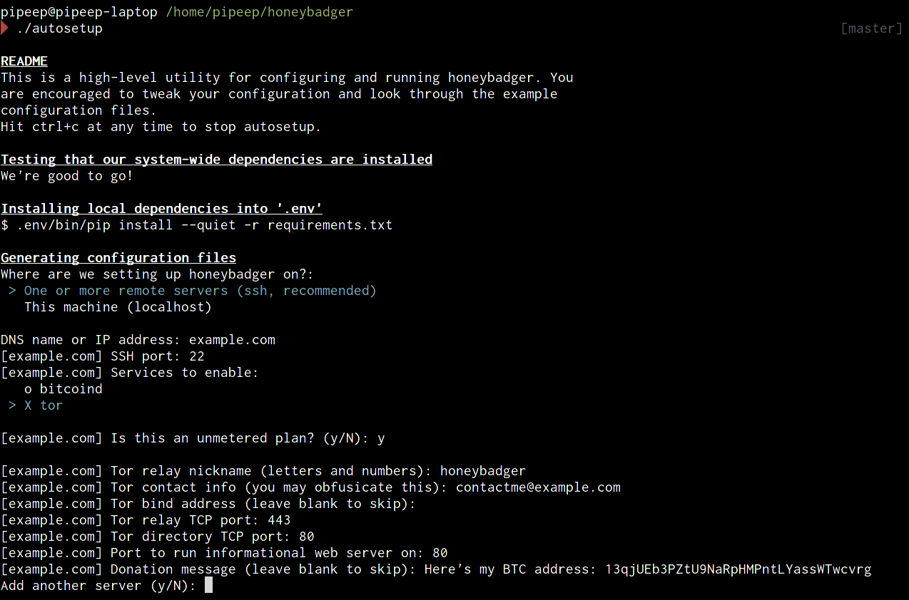
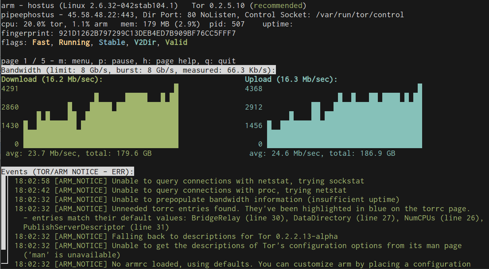
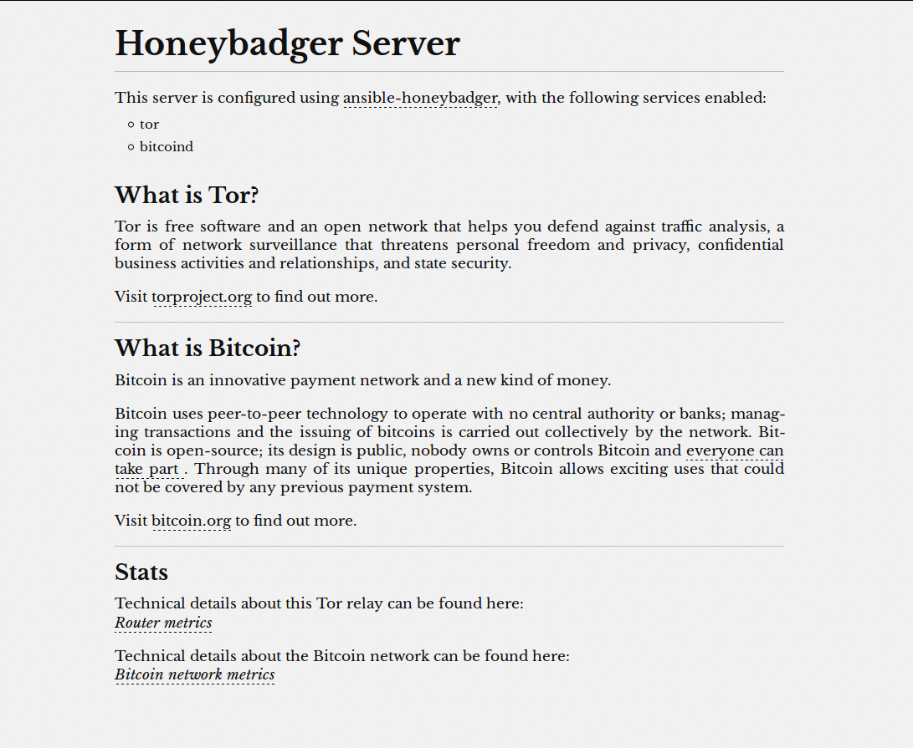

---


<https://github.com/pipeep/ansible-honeybadger>

---

# Motivation


---

# Motivation

-   Horrible (but cheap!) OpenVZ Hosts
    -   *"Why does my process keep dying?"*
    -   *"Why are apt's GPG keys broken?"*
    -   *"How did they manage to leave out python?"*
-   Patching
    -   Heartbleed

---

# Motivation

-   Migrations
    -   Hosts change their AUP
    -   Many go out of business
        -   *"You mean unmetered gigabit for \$1/mo isn't sustainable!?!?"*
    -   Deployment needs to be fast and easy

---



---

# Ansible

-   Configuration management tool, like Puppet/Chef/Salt/CFEngine/Host Factory
-   Small number of dependencies
    -   Requires no software on the server except python
-   Deployment is very ssh-focused
-   Comparatively easy-ish to learn

---

# Results

It works, and it *scales*!



---

# Components

</img>

---

# Components

## autosetup

-   `#!/bin/sh`
-   Checks system-wide dependencies
    -   `python2`, `libpython2`
    -   `pip`, `virtualenv`
-   Installs ansible in a virtualenv
-   Runs autoconfig script
-   Runs bootstrap script
-   Runs ansible playbook

---

# Components

## autoconfig

-   Interactively prompts
-   Writes out YAML and INI files
-   Skipped by autosetup if config files already exist
    -   Manual configuration is allowed and encouraged
-   *Still one of the biggest pain-points*
    -   Skips over some really cool features
    -   python-inquirer is a little klunky
    -   The code is a mess

---



---

# Components

## bootstrap

-   `#!/bin/sh`
-   Anything that needs to be fixed before Ansible can be run
-   `ssh-copy-id`
-   Fix common configuration problems with apt
-   Install python

---

# Components

## Ansible Playbook

Reads the config files, and installs and configures:

-   tor
-   bitcoind
-   unattended-upgrades
-   monit
-   ufw (iptables)
-   nginx
-   tor-arm
-   htop
-   aptitude

---

# Fun Features

## SSH Command Users

(Ab)uses OpenSSH's ForceCommand to let you run things:

-   `ssh htop@example.com`
-   `ssh tor-arm@example.com`
-   `ssh aptitude@example.com`
-   `ssh monit@example.com`
-   `ssh bitcoind-getinfo@example.com`
-   `ssh bitcoind-getpeerinfo@example.com`

This lets us expose monitoring tools in a less-technical way.

---



---

# Fun Features

## Nginx Information Server



---

# Fun Features

## Change Tor's Process Name

-   Sleezy OpenVZ providers will sometimes just `killall tor`, despite not 
    banning Tor in their AUP/TOS.
-   Use `LD_PRELOAD` to inject a library that renames `tor`.

---

# Fun Features

## CPULimit

From an actual AUP:

> To ensure the best performance for all of our customers, we use the following 
> policies:
>
> Your VPS should not have a load of 0.9 for more than two hours per day, or 
> your VPS will get restarted.

*If you need an argument of why OpenVZ is a bad idea on a multi-tenet system, 
that's why.*

---

# Fun Features

## CPULimit

-   `bitcoind` uses a *ton* of CPU and I/O on initial sync
    -   Version 0.10 improves this a little
-   `nice` doesn't control I/O
-   `ionice` doesn't work on OpenVZ
-   `cpulimit` does, but...
-   Ubuntu's `cpulimit` package doesn't use process groups
    -   When a daemon forks, `cpulimit` is useless

---

# Fun Features

## CPULimit

-   Use a different version of `cpulimit` supporting process groups
-   Compile from source
-   Inject into upstart

```sh

post-start script
    sleep 3 # wait for the pid file to get written out
    PID=$(cat /var/lib/bitcoind/bitcoind.pid)
    /opt/cpulimit/src/cpulimit -il {{ bitcoind_cpulimit }} -p $PID &
end script

```

---

# Take-Away

-   Monitoring is critical
-   *Never* use lowendtalk/lowendbox for important workloads
    -   It'll almost always cause you to waste more in time than you'll save in 
        money
-   Unmetered doesn't means unlimited
-   Servers don't need to be reliable or trusted to be useful
-   Never underestimate shell scripts

---


<https://github.com/pipeep/ansible-honeybadger>
